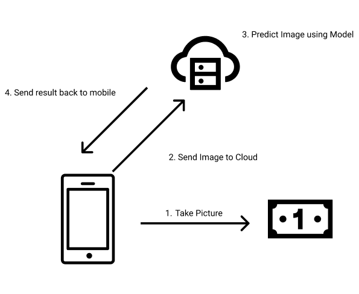
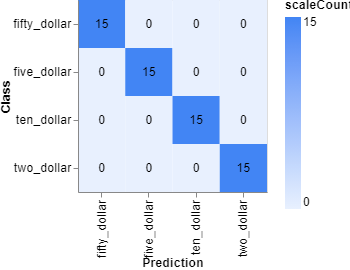
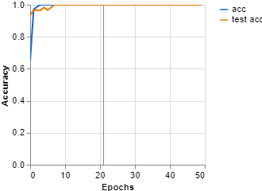
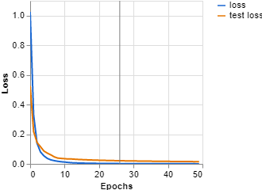
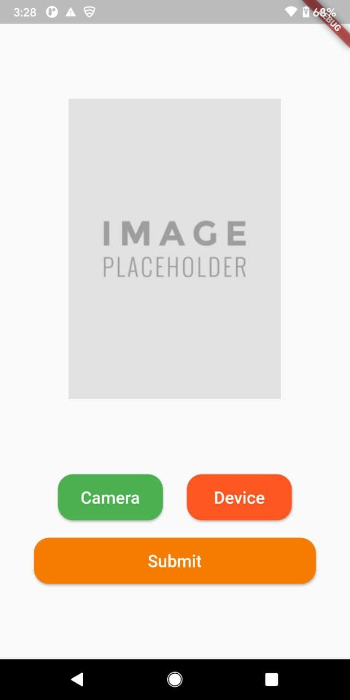
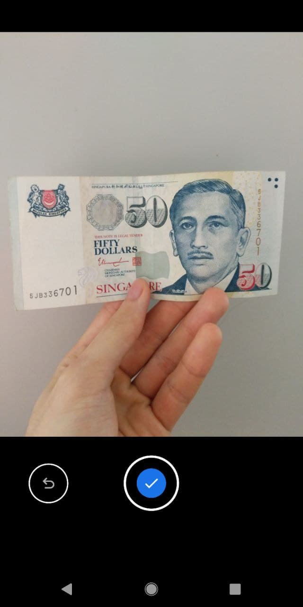
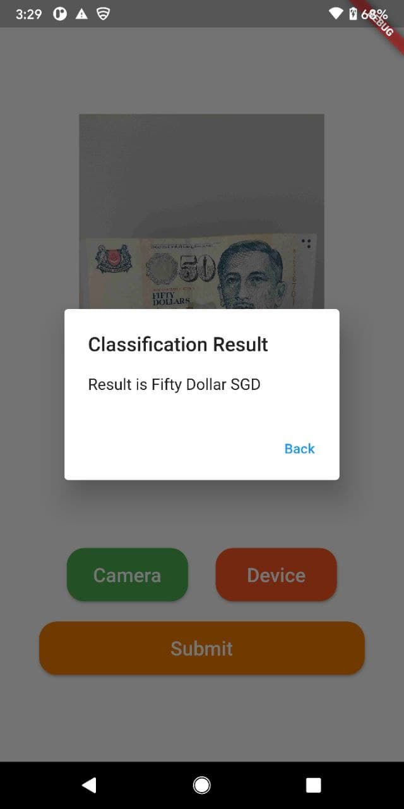
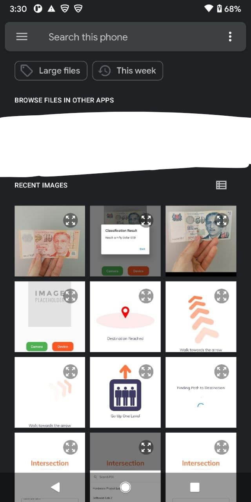
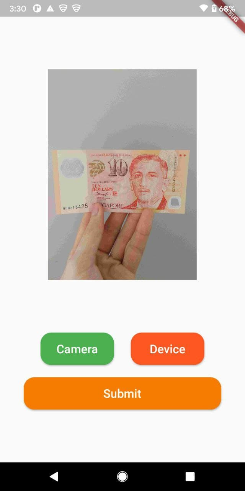
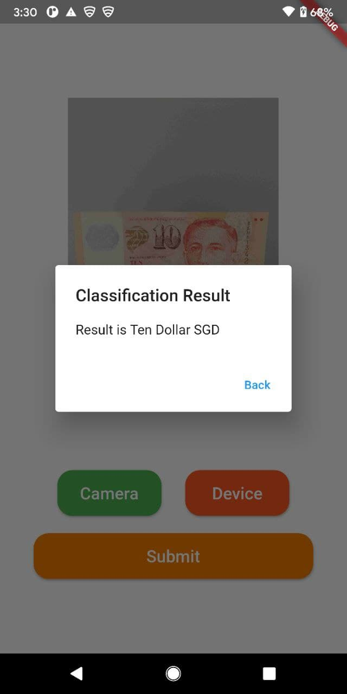

# CX4171: Internet of Things: Communication & Networking

## Bank Note Classification Mobile Application

For this project, I have created a mobile application that is able to classify an image of a bank note using the user's smartphone. The user can either take an image of the bank note using their smartphone's camera or select a bank note image that is already in their gallery. The user is able to send the image over to the model that is hosted on Azure Machine Learning cloud service and conduct a prediction based on the image sent. The prediction result will be sent back to the app which will be displayed to the user.

# Part 1: Image Classification Model

Our model is trained using Google's Teachable Machine Platform. As there are no available dataset for Singapore's bank notes, I took 100 different images of each of the bank notes for my training data. These images are uploaded on the Teachable Machine Platform and trained using the following parameter:

- Epochs: 50
- Batch Size: 16
- Learning Rate: 0.001

The result of this training are as follows:

## Confusion Matrix

## Accuracy per Epoch

## Loss per Epoch

With the completed training, the model will be exported to Tensorflow in the Keras format. This model will be stored in _'/CX4171 Project - Bank Note Image Classification/money-image-classification/models'_

A Teachable Machine file for the training I did can be found in the root folder in _'CX4171 Project - Bank Note Image Classification/IOT Modey Model.tm'_. This file can be opened up in the Teachable Machine website where you can adjust the parameters and export your own model.

# Part 2: Azure Machine Learning

The cloud platform we will be hosting our model on will be the Azure Machine Learning service. This service allows us to deploy the model using Python to the cloud. More information on how to deploy the model onto Azure Machine Learning can be found in the Jupyter Notebook in _'/CX4171 Project - Bank Note Image Classification/money-image-classification/CX4171 Internet of Things Project - Bank Note Image Classification.ipynb'_

With the model hosted on the cloud, we will be able to send a POST request to the endpoint with the image data in order for the model to conduct a prediction. The prediction result will be sent back to the app.

# Part 3: Mobile Application

The mobile application was created using Flutter. This allows for cross-platform development using a single code base. For this project, I will primarily be focusing on Android. The source code for the app can be found in _'/CX4171 Project - Bank Note Image Classification/iotbanknoteclassification'_. Please read the README.md inside the folder to know how to set up the app.

## Main Page

This is the main page of the application. The placeholder shows where the image the user selected will be displayed. The app allows the user to upload an image either using the smartphone's native camera or from the user's gallery. Once the user selected an image, they can tap on submit to send the request.

## Selection - Taking Picture

If the user tap on the Camera button, it will open up the device's camera and the user will have to take a picture of the bank note. Once they are satisfied with the picture, they can tap on the Ok button.

## Submit - Taking Picture

The image taken will be shown in the placeholder and the user can tap on Submit to send the classification request to the model in Azure Machine Learning service. Once the model predicted the result, it will send the result back to the app and the result will be displayed to the user via a dialog box.

## Selection - Gallery 1

By tapping on the Device button, the user is able to to select an image from their gallery.

## Selection - Gallery 1

Once they have selected a bank note image, the image will be displayed on the placeholder.

## Submit - Gallery

When the user tap on the Submit button, a request will be sent to the model in Azure Machine Learning service. The model will conduct a prediction and send the result back to the user. The result will be displayed to the user via a dialog box.

# Tasks Checklist

- Local Inference:
  - Collect User Input (15)
    - Collected real-time input using camera :white_check_mark:
  - Infer locally and display result (20)
    - Inference is offload to Azure Machine Learning in the cloud :white_check_mark:
    - Result is displayed to user via dialog box :white_check_mark:
  - Run on Emulated/physical IoT device (15)
    - Ran on physical Android Device :white_check_mark:
- Cloud Inference:
  - Run inference in cloud virtual machine (10)
    - Model is hosted on Azure Machine Learning :white_check_mark:
  - Communicate between IoT device & cloud (20)
    - App can send image data to Azure Machine Learning end point for inference :white_check_mark:
    - Results from the model's prediction can be sent back from the cloud to the app :white_check_mark:
- Advanced Tasks:
  - Train your own model (10)
    - Trained my own model using Google's Teachable Machine Learning Platform :white_check_mark:
  - Support multiple concurrent users (10)
    - Azure Machine Learning is able to support multiple concurrent users hitting it's service's end point :white_check_mark:

# Video Demo on Actual Android Device

<a href="https://youtu.be/q5GzTx9mBoc" target="_blank">Youtube Link</a>
